# Phishing para captura de senhas do Facebook

### Ferramentas

- Kali Linux
- setoolkit

#### Importante:
Antes de prosseguir com as instruções, ao tentar resolver o desafio de phishing da trilha Cybersecurity Specialist, me deparei com a página atual do Facebook implementando boas práticas para defender os campos de login e senha usando scripts de codificação e hashing. Portanto, não consegui sucesso seguindo exatamente os mesmos passos do instrutor.

Pesquisei e encontrei uma forma de driblar essa proteção nos dois links abaixo. Não vou replicar o passo a passo aqui por considerá-lo desnecessário e para evitar repetição, visto que o trabalho realizado pelo **Romullo** ([@RLLKLLSS](https://github.com/RLLKLLSS)) nos links está claro e perfeito.

- [link 1](https://web.dio.me/articles/sobre-o-setoolkit-e-o-facebook?page=1&order=oldest)
- [link 2](https://github.com/RLLKLLSS/cibersecurity-desafio-phishing)
  
### Configurando o Phishing no Kali Linux

### 1 Passo
- Acesso root: ``` sudo su ```
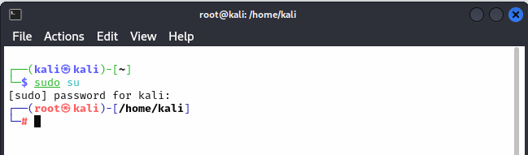

### 2 Passo
- Iniciando o setoolkit: ``` setoolkit ```
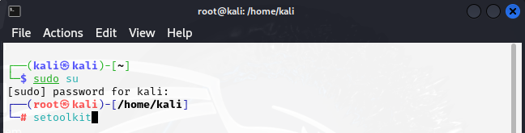

### 3 Passo
- Tipo de ataque: ``` Social-Engineering Attacks ```
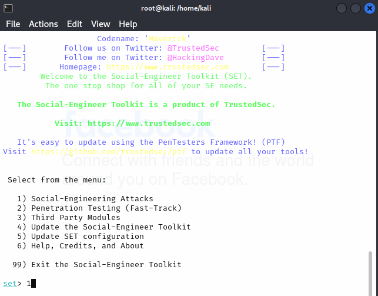

### 4 Passo
- Vetor de ataque: ``` Web Site Attack Vectors ```
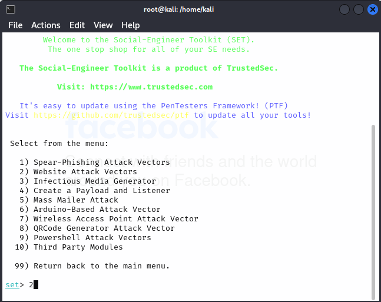

### 5 Passo
- Método de ataque: ```Credential Harvester Attack Method ```
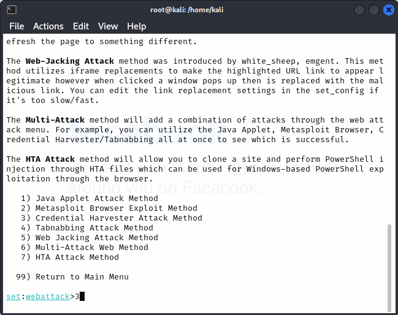

### 6 Passo
Observação: A partir deste ponto, recomendo que você consulte o tópico **"Importante"** mencionado acima para prosseguir. Após baixar a página do Facebook e remover a linha do script que implementa a proteção conforme a orientação, retorne a este ponto para continuar.

 Feito o procedimento, voltamos ao terminal.
- Método de ataque: ``` Custom Import ```
  
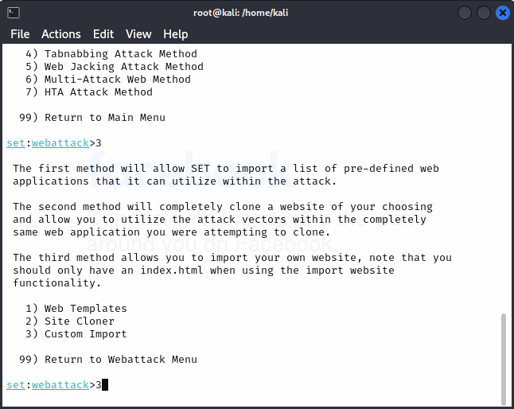

### 7 Passo
- Nesta tela, será sugerido um IP para acessar o site clone. Para confirmar a sugestão, simplesmente pressione a tecla "Enter".
- Caso precise obter o endereço da máquina, use em outro terminal: ``` ifconfig ```
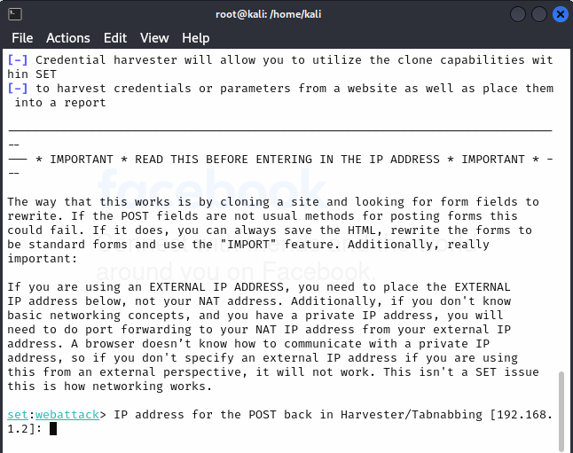

### 8 Passo
- Nesta etapa, insira o caminho onde estão localizados os arquivos da página do Facebook, conforme indicado no tópico "Importante".
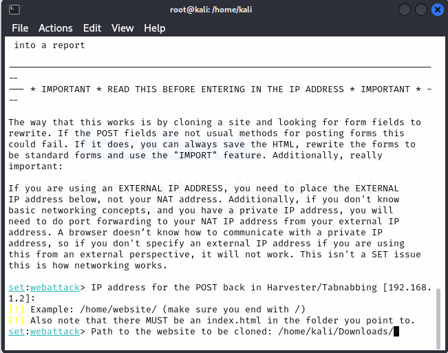

### 9 Passo
- Nesta etapa, confirmo que utilizarei todo o diretório selecionado.
Observação: Uma vez realizados os procedimentos anteriores, o sistema copiará o conteúdo baixado e editado para ser usado como sua página clonada após a confirmação do diretório.
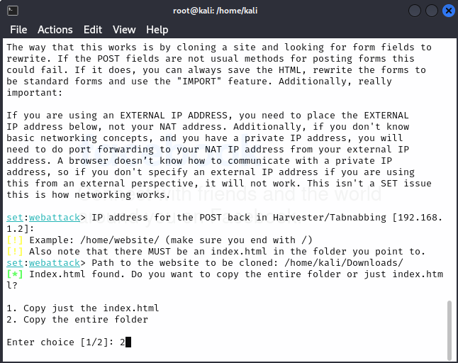

### 10 Passo
- Nesta etapa, digite a URL do site importado: http://facebook.com.
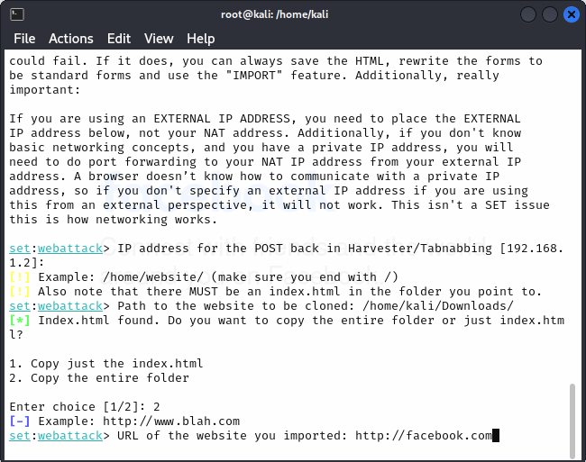

### 11 Passo
- Nesta etapa, vou abrir o navegador e digitar na barra de endereços o IP sugerido anteriormente (http://192.168.1.2) para acessar a página clonada. Em seguida, vou inserir um email e senha de teste para prosseguir com a captura.
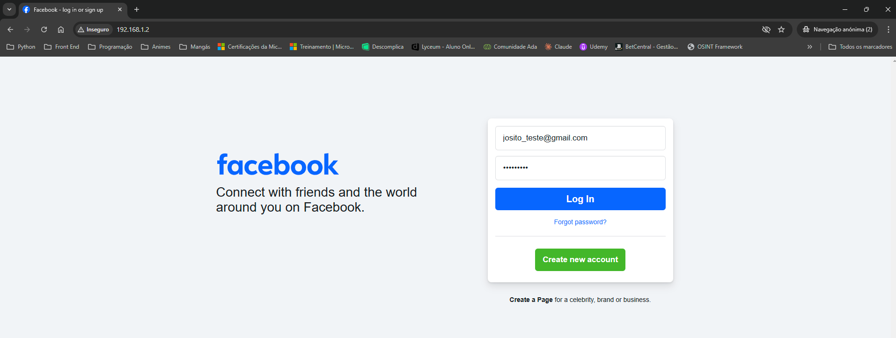

### 12 Passo
- Aqui estão o email e a senha devidamente capturados.
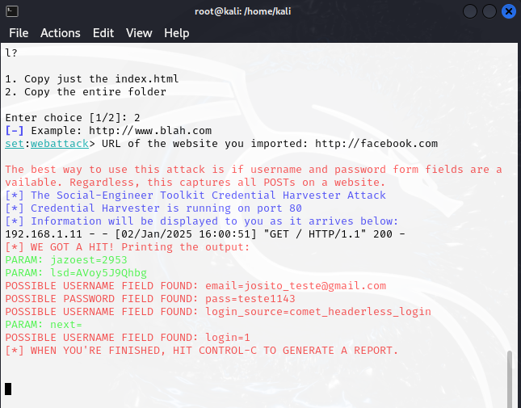